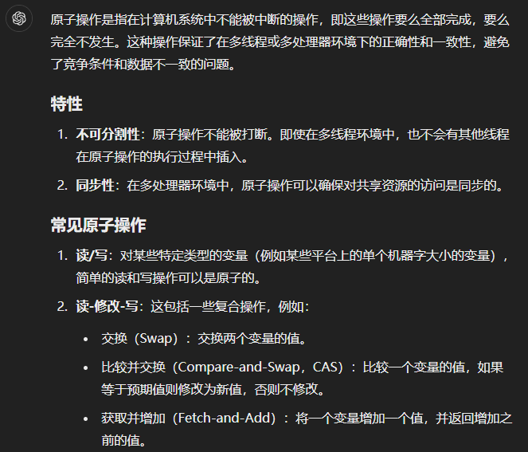

# lab7: MUltithreading

实验目的：熟悉多线程。在用户级线程包中实现线程之间的切换；使用多个线程来加速程序；并实现一个屏障。

## 实验1 Uthread: switching between threads (moderate) -- 实现用户级线程系统中的线程切换

1. 在 uthread_switch.S(汇编代码)中实现两个线程之间的上下文切换，涉及保存当前线程的寄存器状态，并恢复要切换到的目标线程的寄存器状态。这部分可借鉴内核态的线程切换函数 switch(),在 switch.S 中；

2. 添加 context 结构体，用于保存 ra、sp 以及 callee-saved registers (借鉴 proc.h);

3. 在 thread_schedule 中调用 thread_switch 进行上下文切换；

4. 补齐 thread_create部分，在创建线程的时候定义线程的返回地址寄存器和栈指针寄存器。

## 实验2 sing threads (moderate) -- 实验多个线程来加速程序(哈希表键值插入)，探究使用多线程时导致哈希表表键值丢失的原因，并解决

1. 由于 race-condition 导致的数据丢失的问题

        [假设键 k1、k2 属于同个 bucket]

        thread 1: 尝试设置 k1
        thread 1: 发现 k1 不存在，尝试在 bucket 末尾插入 k1
        --- scheduler 切换到 thread 2
        thread 2: 尝试设置 k2
        thread 2: 发现 k2 不存在，尝试在 bucket 末尾插入 k2
        thread 2: 分配 entry，在桶末尾插入 k2
        --- scheduler 切换回 thread 1
        thread 1: 分配 entry，没有意识到 k2 的存在，在其认为的 “桶末尾”（实际为 k2 所处位置）插入 k1

        [k1 被插入，但是由于被 k1 覆盖，k2 从桶中消失了，引发了键值丢失]

2. 解决措施 -- 加锁，pthread 关于锁的调用包括

        pthread_mutex_t lock; // declare a lock
        pthread_mutex_init(&lock, NULL); // initialize the lock
        pthread_mutex_lock(&lock); // acquire lock
        pthread_mutex_unlock(&lock); // release lock

3. 考虑锁的粒度，由于哈希表中，不同的 bucket 是互不影响的，一个 bucket 处于修改未完全的状态并不影响 put 和 get 对其他 bucket 的操作，所以实际上只需要确保两个线程不会同时操作同一个 bucket 即可，即可以为每个 bucket 分配一个锁。同时注意锁操作（加锁、解锁、锁竞争）是有开销的，所以实际的速度并没有达到理想的 单线程速度 * 线程数 那么快。

## 实验3 Barrier(moderate) -- 实现同步屏障机制(barrier)，即确保所有线程在每一轮次上都同步，直到所有线程都到达屏障点，然后继续执行

1. 实现屏障的工具 -- 互斥锁(pthread_mutex) 和 条件变量(pthread_cond)

2. 实现屏障的逻辑：

        线程进入同步屏障 barrier 时，将已进入屏障的线程数量增加 1，然后再判断是否已经达到总线程数。
        如果未达到，则进入睡眠，等待其他线程。
        如果已经达到，则唤醒所有在 barrier 中等待的线程，所有线程继续执行；屏障轮数 + 1；

        「将已进入屏障的线程数量增加 1，然后再判断是否已经达到总线程数」这一步并不是原子操作，并且这一步和后面的两种情况中的操作「睡眠」和「唤醒」之间也不是原子的，如果在这里发生 race-condition，则会导致出现 「lost wake-up 问题」（线程 1 即将睡眠前，线程 2 调用了唤醒，然后线程 1 才进入睡眠，导致线程 1 本该被唤醒而没被唤醒，详见 xv6 book 中的第 72 页，Sleep and wakeup）

        解决方法是，「屏障的线程数量增加 1；判断是否已经达到总线程数；进入睡眠」这三步必须原子。所以使用一个互斥锁 barrier_mutex 来保护这一部分代码。pthread_cond_wait 会在进入睡眠的时候原子性的释放 barrier_mutex，从而允许后续线程进入 barrier，防止死锁。

**原子操作**

