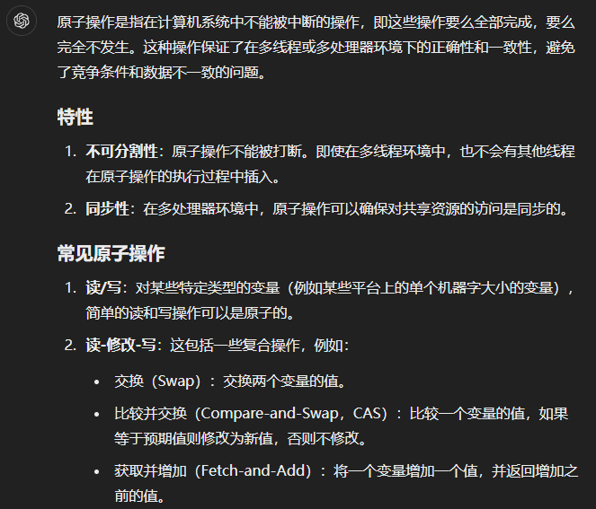

# lab6: Copy-on-wriyte Fork for XV6
在计算机系统中有一种说法，任何系统问题都可以用某种程度的抽象方法来解决。Lazy allocation实验中提供了一个例子。这个实验探索了另一个例子：写时复制分支（copy-on write fork）。
### 背景(问题)
>
xv6中的fork()系统调用将父进程的所有用户空间内存复制到子进程中。如果父进程较大，则复制可能需要很长时间。更糟糕的是，这项工作经常造成大量浪费；例如，子进程中的fork()后跟exec()将导致子进程丢弃复制的内存，而其中的大部分可能都从未使用过。另一方面，如果父子进程都使用一个页面，并且其中一个或两个对该页面有写操作，则确实需要复制。
>
### 解决方案
>
copy-on-write (COW) fork()的目标是推迟到子进程实际需要物理内存拷贝时再进行分配和复制物理内存页面。

COW fork()只为子进程创建一个页表，用户内存的PTE指向父进程的物理页。COW fork()将父进程和子进程中的所有用户PTE标记为不可写。当任一进程试图写入其中一个COW页时，CPU将强制产生页面错误。内核页面错误处理程序检测到这种情况将为出错进程分配一页物理内存，将原始页复制到新页中，并修改出错进程中的相关PTE指向新的页面，将PTE标记为可写。当页面错误处理程序返回时，用户进程将能够写入其页面副本。

COW fork()将使得释放用户内存的物理页面变得更加棘手。给定的物理页可能会被多个进程的页表引用，并且只有在最后一个引用消失时才应该被释放。（需要引用计数机制）
>
### 实验步骤
将只创建引用而不进行实际内存分配的页复制过程称为「懒复制」，将分配新的内存空间并将数据复制到其中的过程称为「实复制」。
#### 1. fork 时不立刻复制内存
首先修改 uvmcopy(), 在复制父进程的内存到子进程的时候，不立刻复制数据，而是建立指向原物理页的映射，并将父子两端的页表项都设置为不可写(vm.c); 需要在 riscv.h z中添加 PET_COW 标志位。
这样，fork 时就不会立刻复制内存，只会创建一个映射了。这时候如果尝试修改懒复制的页，会出现 page fault 被 usertrap() 捕获。接下来需要在 usertrap() 中捕捉这个 page fault，并在尝试修改页的时候，执行实复制操作。
#### 2. 捕获写操作并执行复制
a. 与 lazy allocation lab 类似，在 usertrap() 中添加对 page fault 的检测，并在当前访问的地址符合懒复制页条件时，对懒复制页进行实复制操作（trap.c）
b. 同时 copyout() 由于是软件访问页表，不会触发缺页异常，所以需要手动添加同样的监测代码（同 lab5），检测接收的页是否是一个懒复制页，若是，执行实复制操作（vm.c）
c. 实现懒复制页的检测（uvmcheckcowpage()）与实复制（uvmcowcopy()）操作 （vm.c）
这样就完成了大体的逻辑：在 fork 的时候不复制数据只建立映射+标记，在进程尝试写入的时候进行实复制并重新映射为可写。
接下来，还需要做页的生命周期管理，确保在所有进程都不使用一个页时才将其释放。
#### 3. 物理页生命周期以及引用计数
在 kalloc.c 中，我们需要定义一系列的新函数，用于完成在支持懒复制的条件下的物理页生命周期管理。
在原本的 xv6 实现中，一个物理页的生命周期内，可以支持以下操作：
>
kalloc(): 分配物理页
kfree(): 释放回收物理页
>

而在支持了懒分配后，由于一个物理页可能被多个进程（多个虚拟地址）引用，并且必须在最后一个引用消失后才可以释放回收该物理页，所以一个物理页的生命周期内，现在需要支持以下操作：
>
kalloc(): 分配物理页，将其引用计数置为 1
krefpage(): 创建物理页的一个新引用，引用计数加 1
kcopy_n_deref(): 将物理页的一个引用实复制到一个新物理页上（引用计数为 1），返回得到的副本页；并将本物理页的引用计数减 1
kfree(): 释放物理页的一个引用，引用计数减 1；如果计数变为 0，则释放回收物理页
>
一个物理页 p 首先会被父进程使用 kalloc() 创建，fork 的时候，新创建的子进程会使用 krefpage() 声明自己对父进程物理页的引用。当尝试修改父进程或子进程中的页时，kcopy_n_deref() 负责将想要修改的页实复制到独立的副本，并记录解除旧的物理页的引用（引用计数减 1）。最后 kfree() 保证只有在所有的引用者都释放该物理页的引用时，才释放回收该物理页。

这里，为 pageref[] 数组定义了自旋锁 pgreflock，并且在除了 kalloc 的其他操作中，都使用了 acquire(&pgreflock); 和 release(&pgreflock); 获取和释放锁来保护操作的代码。这里的锁的作用是防止竞态条件（race-condition）下导致的内存泄漏。
